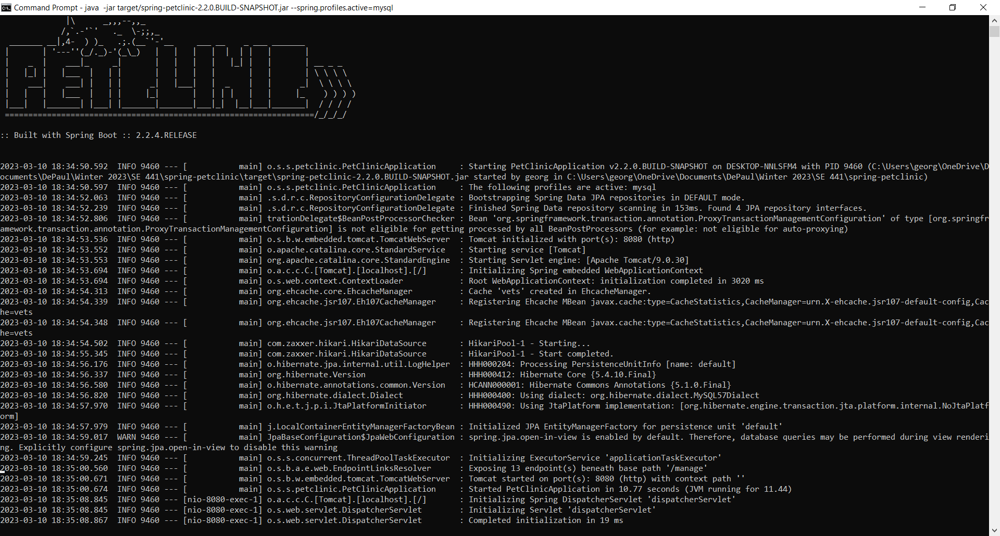

# Instructions
George Floros
Student ID: 1865309 

#Deliverables [50 pts]

#Docker
- [5 pts] Your dockerfile. Please provde a link to this file rather than a screen capture.
[Link to the dockerfile](https://github.com/gfloros1/spring-petclinic/blob/master/HW8/Dockerfile)
- [5 pts] Your running docker instance as shown by a ps command.

- [5 pts] Your browser accessing the main page of the website from your local container.

#Docker Compose - MySQL Only
- [5 pts] The output from the docker-compose up command.

- [5 pts] Your browser accessing the “Veterinarians” page of the website from your local container when you run the application from the host system.

- [5 pts] A section of the stack trace generated when you attempt to run the application container that has been updated to use MySQL.

#Docker Compose - App Server and MySQL
- [5 pts] Your updated docker-compose.yml file containing the application server, built from your local Dockerfile, and the existing MySQL configuration. Please provide a link to this file rather than a screen capture.
[Link to the docker-compose.yml file](https://github.com/gfloros1/spring-petclinic/blob/master/HW8/docker-compose.yml)
- [5 pts] Your updated application-mysql.properties file containing the URL change for the database server. Please provide a link to this file rather than a screen capture.
[Link to the application-mysql.properties file](https://github.com/gfloros1/spring-petclinic/blob/master/HW8/application-mysql.properties)
- [5 pts] The output from the docker-compose up command.

- [5 pts] Your browser accessing the “Veterinarians” page of the website from your local container.
