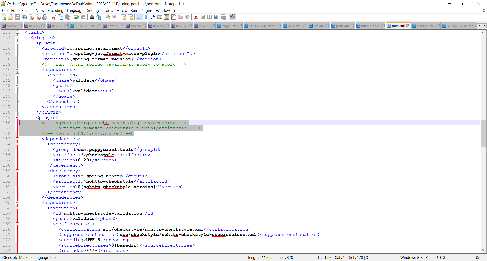
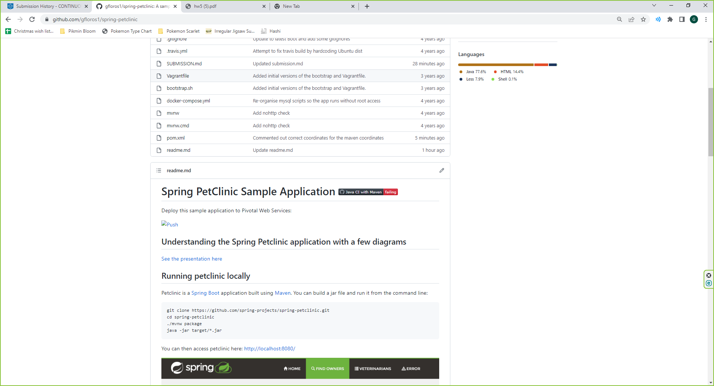
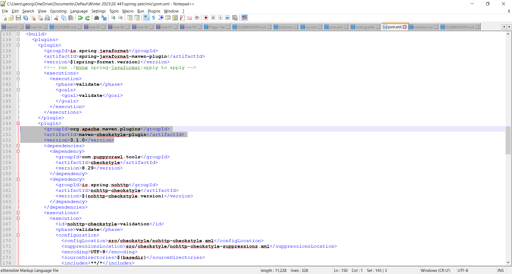
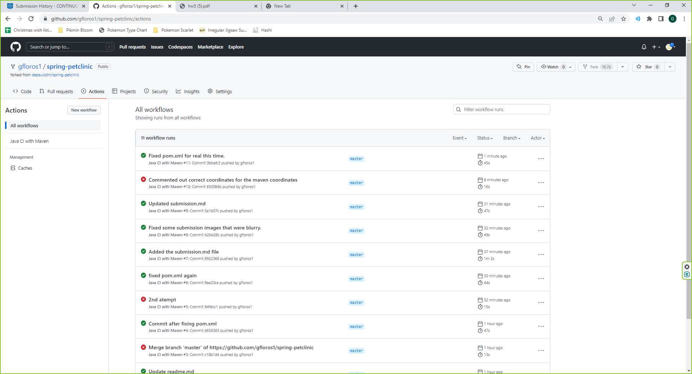

# Instructions
George Floros
Student ID: 1865309 

#Deliverables [50 pts]
- [5 pts] Your GitHub account showing that is has been forked from the depaulcdm/springpetclinic repository.

- [5 pts] Your GitHub Actions dashboard showing a successful first build.

- [5 pts]  Your GitHub repository with the readme.md file selected showing the code that you changed to update the badge.

- [5 pts] Your GitHub repository with the readme.md file selected showing the build success status after you’ve updated the badge markdown.

- [5 pts] The section of the POM file showing the coordinates after you’ve commented them out.

- [5 pts] Your GitHub Actions dashboard showing the unsuccessful build after the breaking change.

- [5 pts]  Your GitHub repository with the readme.md file selected showing the build failed status after the GitHub workflow fails.

- [5 pts] The section of the POM file showing the coordinates after you’ve fixed them.

- [5 pts]  Your GitHub Actions dashboard showing the successful build after the breaking change has been fixed.

- [5 pts]  Your GitHub repository with the readme.md file selected showing the build success status after the GitHub workflow has recovered.
